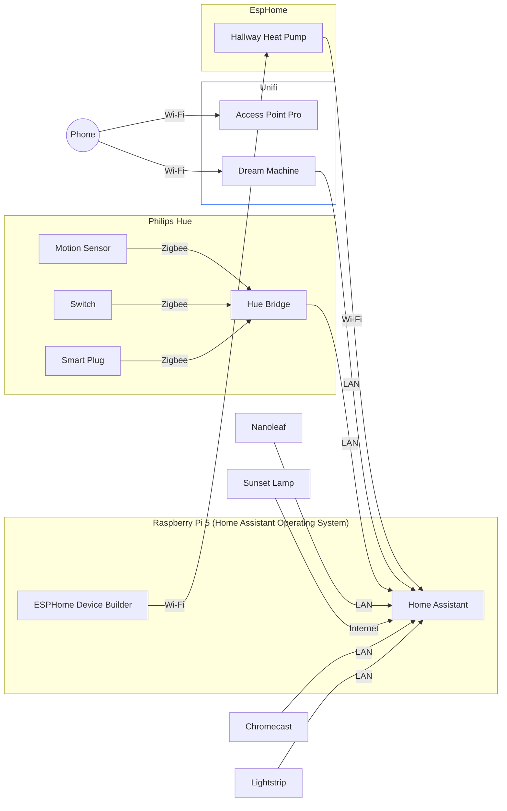

# HomeConfig

## System Design Layout

```mermaid
flowchart LR
 subgraph s1["Raspberry Pi 5 (Home Assistant Operating System)"]
        n1["Home Assistant"]
        n5["ESPHome Device Builder"]
  end
 subgraph s2["EspHome"]
        n3["Hallway Heat Pump"]
  end
 subgraph s3["Philips Hue"]
        n6["Hue Bridge"]
        n7["Motion Sensor"]
        n8["Switch"]
        n9["Smart Plug"]
  end
 subgraph s4["Unifi"]
        n11["Access Point Pro"]
        n12["Dream Machine"]
  end
    n7 -- Zigbee --> n6
    n8 -- Zigbee --> n6
    n9 -- Zigbee --> n6
    n5 -- "Wi-Fi" --> n3
    n3 -- "Wi-Fi" --> n1
    n10(("Phone")) -- "Wi-Fi" --> n11 & n12
    n12 -- LAN --> n1
    n6 -- LAN --> n1
    n13["Nanoleaf"] -- LAN --> n1
    n14["Sunset Lamp"] -- Internet --> n1
    n15["Chromecast"] -- LAN --> n1
    n16["Lightstrip"] -- LAN --> n1

    n5@{ shape: rect}
    n7@{ shape: proc}
    n8@{ shape: rect}
    n9@{ shape: rect}
    n12@{ shape: rect}
    n13@{ shape: rect}
    n14@{ shape: rect}
    n15@{ shape: rect}
    n16@{ shape: rect}
    style s4 stroke:#2962FF,fill:transparent
```
